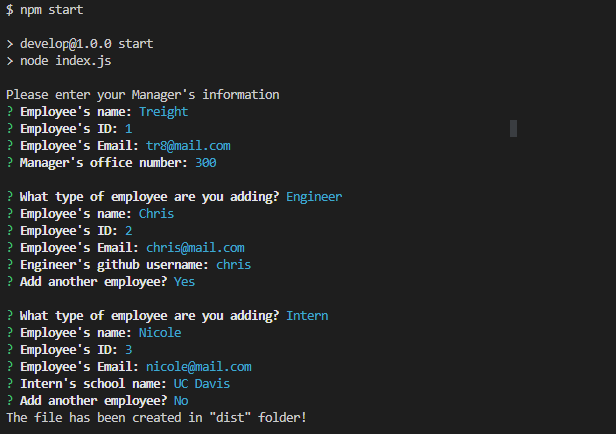
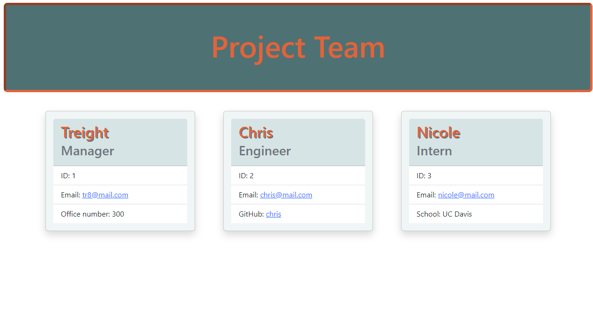

# Team HTML Generator

## Description

I made this project to be able to generate websites with just some user input. I was able to start the project with test-driven development and object-oriented programming. I was able to practice and put in use javascript classes along with tests for them. 

## Installation

- Have Nodejs installed (I used v16.18)
- Install npm dependencies
    - use 'npm install' on terminal once navigated to folder

## Usage

Navigate to folder where index.js is located in your terminal then run the file using node, "node index.js" or use "npm start". You will be prompted to enter the project's manager information. Then you'll do the same for an employee, either an engineer or an intern. The program will then ask you if you wish to add another member and repeat the engineer/intern questions. This will continue to repeat until you wish to stop adding members then it will generate an HTML file in [this folder](./dist/). Use any browser to open the HTML file which will display a website generated using the information you provided including making links. Please see the
[video demonstration](https://drive.google.com/file/d/1f-z4HC2X1LR7frlZjWk1a8fqbp_9WOEc/view) for it in practice. Below are example images of the terminal and the resulting website. 

## License

N/A